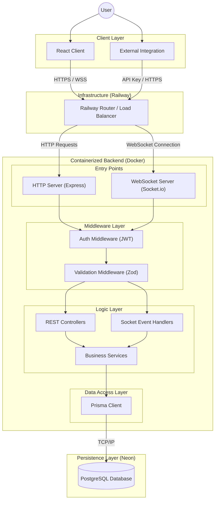
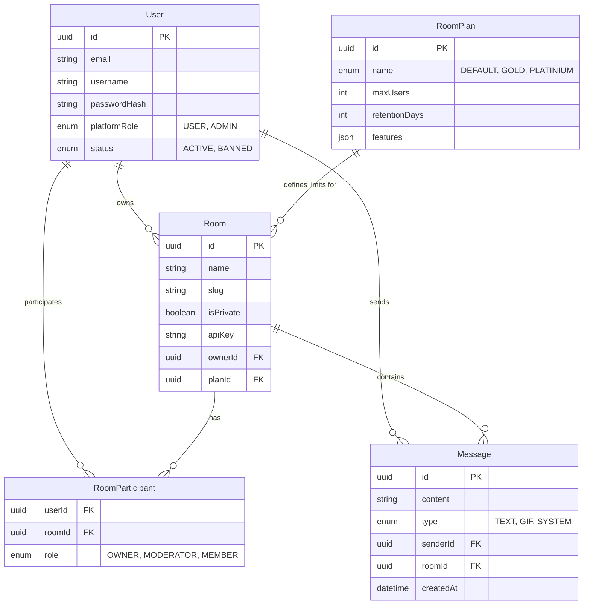
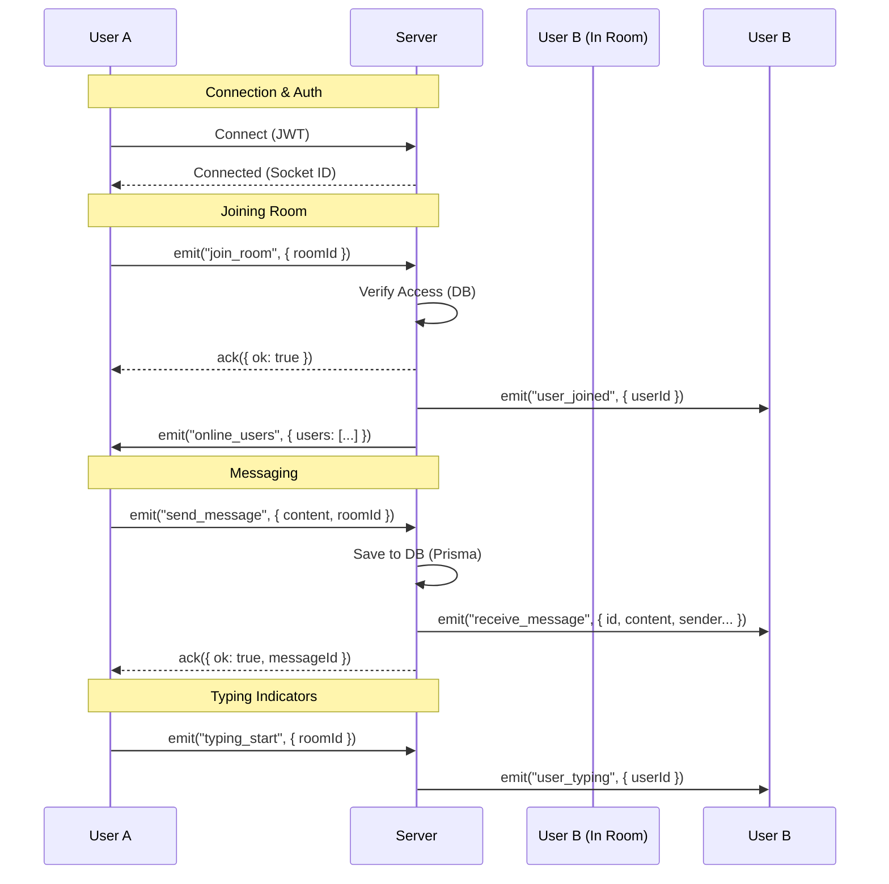
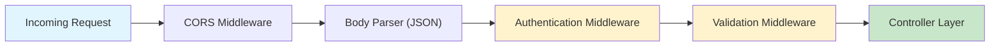
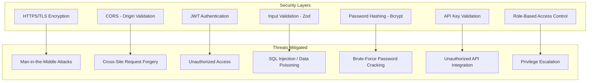

# ChatUZO Backend - Comprehensive Documentation

## 1. Introduction

### Problem Definition
Modern web applications often require integrated real-time communication features. However, building a scalable, secure, and feature-rich chat system from scratch is complex. Developers face challenges such as:
*   **Scalability:** Handling thousands of concurrent connections.
*   **Multi-tenancy:** Managing isolated chat rooms for different communities or businesses.
*   **Access Control:** Implementing granular permissions (Admin, Moderator, Member).
*   **Integration:** Embedding chat widgets into existing websites easily.

### Project Motivation
**ChatUZO** was designed to solve these problems by providing a robust, "backend-as-a-service" solution for chat. It abstracts the complexities of WebSocket management, database persistence, and authentication, allowing developers to focus on their frontend applications. The goal is to offer a **white-label**, **plan-based** chat infrastructure that can be deployed independently and integrated via API Keys.

### Target Users
1.  **SaaS Developers:** Who need to add chat functionality to their products without reinventing the wheel.
2.  **Community Managers:** Who want to create private or public chat rooms with specific rules and moderation tools.
3.  **Enterprises:** Requiring a secure, self-hosted communication channel with audit logs and role management.

---

## 2. Architecture

### System Architecture Diagram

The system follows a layered architecture, separating concerns between the API (REST), Real-time Service (Socket.io), and Data Persistence (Prisma/PostgreSQL).



### Technologies Used

| Category | Technology | Purpose |
|----------|------------|---------|
| **Runtime** | **Node.js (v20)** | High-performance, non-blocking I/O for real-time apps. |
| **Language** | **TypeScript** | Type safety, better developer experience, and maintainability. |
| **Web Framework** | **Express.js** | Handling REST API routes and middleware. |
| **Real-time** | **Socket.io** | WebSocket abstraction for bidirectional communication. |
| **Database** | **PostgreSQL** | Relational database for storing users, rooms, and messages. |
| **ORM** | **Prisma** | Type-safe database client and schema management. |
| **Validation** | **Zod** | Runtime schema validation for API inputs. |
| **Authentication** | **JWT & Bcrypt** | Stateless authentication and password hashing. |
| **Deployment** | **Docker & Railway** | Containerization and cloud deployment platform. |

### Folder Structure Explanation

The project follows a **Service-Controller-Repository** pattern (abstracted via Prisma) to ensure clean code and separation of concerns.

```
server/
├── prisma/                 # Database configuration
│   ├── schema.prisma       # Database schema definition
│   └── migrations/         # SQL migration files
├── src/
│   ├── config/             # Environment and app configuration
│   │   ├── env.ts          # Type-safe env variables
│   │   └── prisma.ts       # Prisma client instance
│   ├── controllers/        # Request handlers (REST)
│   │   ├── auth.controller.ts
│   │   ├── room.controller.ts
│   │   └── ...
│   ├── middlewares/        # Express middlewares
│   │   ├── auth.middleware.ts      # JWT verification
│   │   └── validate.middleware.ts  # Zod schema validation
│   ├── realtime/           # Socket.io logic
│   │   ├── socket.ts       # Main socket server setup
│   │   └── middlewares/    # Socket-specific auth
│   ├── routes/             # API Route definitions
│   ├── schema/             # Zod validation schemas
│   ├── services/           # Business logic (DB operations)
│   │   ├── auth.service.ts
│   │   ├── room.service.ts
│   │   └── ...
│   ├── types/              # TypeScript type definitions
│   ├── utils/              # Helper functions
│   ├── app.ts              # Express app setup
│   └── index.ts            # Entry point (HTTP + Socket server)
├── Dockerfile              # Docker build instructions
└── package.json            # Dependencies and scripts
```

---

## 3. Database Schema

The database is designed to support multi-tenancy and role-based access.



---

## 4. Backend Details & API Documentation

### Authentication & Security
*   **JWT Strategy:** Access tokens are issued upon login and must be included in the `Authorization: Bearer <token>` header for protected routes.
*   **Socket Auth:** The same JWT is used for Socket.io connection handshake (`auth: { token: "..." }`).
*   **Password Security:** Passwords are hashed using `bcrypt` with a salt round of 10.
*   **Input Sanitization:** All inputs are validated against strict Zod schemas to prevent injection and malformed data.

### REST API Endpoints

#### 1. Authentication (`/api/auth`)
| Method | Endpoint | Description | Access |
|:-------|:---------|:------------|:-------|
| `POST` | `/register` | Create a new user account. | Public |
| `POST` | `/login` | Authenticate and receive JWT. | Public |

**Example Register Request:**
```json
{
  "email": "user@example.com",
  "username": "cooluser",
  "password": "SecurePassword123!",
  "birthdate": "1995-05-20"
}
```

#### 2. Rooms (`/api/rooms`)
| Method | Endpoint | Description | Access |
|:-------|:---------|:------------|:-------|
| `POST` | `/` | Create a new chat room. | Auth |
| `GET` | `/my-rooms` | List rooms owned/joined by user. | Auth |
| `GET` | `/:slug` | Get public room info by slug. | Public |
| `GET` | `/api-key/:apiKey` | Get room info for external integration. | Public |
| `GET` | `/:roomId/messages` | Fetch chat history. | Auth |
| `PUT` | `/:id` | Update room settings. | Owner/Admin |
| `DELETE` | `/:id` | Delete a room. | Owner/Admin |

**Example Create Room Request:**
```json
{
  "name": "Tech Talk",
  "slug": "tech-talk-2024",
  "isPrivate": true,
  "password": "roompassword",
  "maxUsers": 50,
  "roomPlanId": "uuid-of-plan",
  "allowedDomains": ["https://mysite.com"],
  "uiSettings": { "theme": "dark" },
  "logicConfig": { "allowGifs": true }
}
```

#### 3. Room Plans (`/api/room-plans`)
| Method | Endpoint | Description | Access |
|:-------|:---------|:------------|:-------|
| `GET` | `/` | List available subscription plans. | Public |
| `POST` | `/` | Create a new plan. | Admin |

#### 4. Users (`/api/users`)
| Method | Endpoint | Description | Access |
|:-------|:---------|:------------|:-------|
| `GET` | `/me` | Get current user profile. | Auth |
| `PUT` | `/me` | Update profile (avatar, bio). | Auth |
| `PUT` | `/:id/role` | Promote/Demote user (Platform Admin). | Admin |

---

## 5. Real-time Communication (Socket.io)

The real-time layer handles instant messaging, presence, and typing indicators.

### Connection
Client connects to `/` namespace.
```javascript
const socket = io("https://api.chatuzo.com", {
  auth: { token: "jwt_token_here" }
});
```

### Event Flow Diagram



### Socket Events Reference

**Client -> Server (Emits):**
*   `join_room`: `{ roomId: string }`
*   `leave_room`: `{ roomId: string }`
*   `send_message`: `{ roomId: string, content: string }`
*   `typing_start`: `{ roomId: string }`
*   `typing_stop`: `{ roomId: string }`

**Server -> Client (Listens):**
*   `receive_message`: Returns full `Message` object.
*   `user_joined`: `{ userId: string, roomId: string }`
*   `user_left`: `{ userId: string, roomId: string }`
*   `user_typing`: `{ userId: string, roomId: string }`
*   `online_users`: `{ roomId: string, users: User[] }`
*   `error`: `{ message: string }`

---

## 6. Middleware & Validation Architecture

### Overview
The middleware system acts as the "gatekeeper" for all incoming requests and socket connections. It ensures authentication, authorization, and data integrity before business logic execution.



### Authentication Middleware (`auth.middleware.ts`)

**Purpose:** Validates JWT tokens and protects routes that require authentication.

**How it works:**
1.  **Token Extraction:** Reads the `Authorization: Bearer <token>` header.
2.  **Token Verification:** Uses `verifyToken()` utility to decode and validate the JWT signature.
3.  **Payload Injection:** Attaches user data to `req.user` for downstream controllers.
4.  **Error Handling:** Returns `401 Unauthorized` if token is missing or invalid.

**Request Flow:**
```
Authorization Header: "Bearer eyJhbGciOiJIUzI1NiIs..."
     ↓
Extract token (remove "Bearer " prefix)
     ↓
Verify signature with JWT_SECRET
     ↓
Decode payload: { sub, email, username, role }
     ↓
Attach to req.user
     ↓
Next middleware / controller
```

**Code Example:**
```typescript
// Protected route using authenticate middleware
router.get('/me', authenticate, getMyProfile);

// Inside controller:
export const getMyProfile = (req: AuthenticatedRequest, res: Response) => {
  const userId = req.user?.id; // Available because middleware set it
  // ...
};
```

**Token Structure (JWT Payload):**
```json
{
  "sub": "user-id-uuid",
  "email": "user@example.com",
  "username": "johndoe",
  "role": "USER",
  "iat": 1704190800,
  "exp": 1704795600
}
```

### Validation Middleware (`validate.middleware.ts`)

**Purpose:** Ensures all request data conforms to expected schemas before business logic processes it.

**Technologies Used:** **Zod** - A TypeScript-first schema validation library.

**How it works:**
1.  **Schema Definition:** Each route has a corresponding Zod schema (e.g., `RegisterSchema`).
2.  **Async Parsing:** Uses `schema.parseAsync(req.body)` to validate and transform data.
3.  **Error Reporting:** If validation fails, returns structured error messages with field-level details.
4.  **Data Transformation:** Converts strings to proper types (e.g., ISO string → Date object).

**Example Validation Schemas:**

```typescript
// Register Schema - From auth.validation.ts
export const RegisterSchema = z.object({
  email: z.string().email("Valid email required"),
  username: z
    .string()
    .min(3, "Username min 3 chars")
    .max(20, "Username max 20 chars")
    .regex(/^[a-zA-Z0-9_]+$/, "Alphanumeric and underscore only"),
  password: z
    .string()
    .min(8, "Password min 8 chars")
    .regex(/[A-Z]/, "At least one uppercase letter")
    .regex(/[0-9]/, "At least one number"),
  birthdate: z.coerce.date().refine(date => date < new Date(), "Birth date must be in the past"),
  avatarUrl: z.string().url().optional().nullable()
});

// Create Room Schema - From room.validation.ts
export const CreateRoomSchema = z.object({
  name: z.string().min(2).max(100),
  slug: z.string().regex(/^[a-z0-9-]+$/, "Lowercase, numbers, hyphens only"),
  isPrivate: z.boolean(),
  password: z.string().optional(),
  maxUsers: z.number().int().positive(),
  allowedDomains: z.array(z.string().url()).min(1),
  roomPlanId: z.string().uuid()
}).refine(data => {
  if (data.isPrivate && !data.password) return false;
  return true;
}, { message: "Private rooms require a password" });
```

**Validation Error Response:**
```json
{
  "message": "Validation hatası",
  "errors": [
    {
      "field": "email",
      "message": "Invalid email"
    },
    {
      "field": "password",
      "message": "At least one uppercase letter required"
    }
  ]
}
```

### CORS Middleware

**Purpose:** Controls which origins (domains) can make cross-origin requests to the API.

**Configuration:**
```typescript
app.use(cors({
    origin: env.CLIENT_ORIGIN,  // E.g., "https://app.chatuzo.com"
    credentials: true             // Allow cookies/auth headers
}));
```

**Behavior:**
*   **Allowed Origins:** Only requests from `CLIENT_ORIGIN` are accepted.
*   **Credentials:** Cookies and Authorization headers are sent with requests.
*   **Rejected Origins:** Return HTTP 403 Forbidden.

---

## 7. Security Considerations

### Security Overview

The platform implements multi-layered security to protect user data and prevent common web vulnerabilities.



### 1. **Transport Security (HTTPS/TLS)**
*   **Implementation:** All traffic between client and server is encrypted using HTTPS/TLS.
*   **Railway Deployment:** Automatically provisions SSL certificates for production domains.
*   **WebSocket Security:** WSS (WebSocket Secure) ensures encrypted real-time communication.

### 2. **Authentication Security**

#### JWT Strategy
*   **Token Expiration:** Tokens expire after `JWT_EXPIRES_IN` (e.g., 7 days). Clients must login again afterward.
*   **Secret Key:** Tokens are signed with `JWT_SECRET` stored securely in environment variables.
*   **Verification:** Every protected route verifies the token signature to ensure it wasn't tampered with.

**Token Lifecycle:**
```
1. User Registers/Logins
   ↓
2. Server generates JWT with user ID and role
   ↓
3. Client stores token (localStorage, sessionStorage, or httpOnly cookie)
   ↓
4. Client includes token in every authenticated request
   ↓
5. Middleware verifies signature and expiration
   ↓
6. Token expires → User must login again
```

#### Password Hashing (Bcrypt)
*   **Algorithm:** Bcrypt with salt rounds = 10.
*   **Salting:** Each password gets a unique salt, making rainbow table attacks infeasible.
*   **Verification:** Login compares entered password against stored hash using `bcrypt.compare()`.

```typescript
// Registration
const passwordHash = await bcrypt.hash(plainPassword, 10);
await db.user.create({ email, username, passwordHash });

// Login
const user = await db.user.findUnique({ where: { email } });
const isValid = await bcrypt.compare(plainPassword, user.passwordHash);
if (isValid) {
  // Issue JWT
}
```

### 3. **Input Validation & Sanitization**

**Zod Validation** prevents malicious or malformed data from reaching the database:

*   **Type Coercion:** Ensures data is the correct type (string, number, date, etc.).
*   **Format Validation:** Email format, URL format, UUID format, regex patterns.
*   **Length Limits:** Prevents extremely large payloads (e.g., 10MB message content).
*   **Business Logic Validation:** Custom refinements (e.g., private rooms require passwords).

**Example Attack Prevention:**
```typescript
// Attempt 1: SQL Injection (prevented by Zod)
// Attack: "'; DROP TABLE users; --"
// Result: Zod rejects it as invalid email format

// Attempt 2: XSS Injection (prevented by Prisma parameterized queries)
// Attack: "<script>alert('XSS')</script>"
// Result: Stored and displayed as literal text, not executed

// Attempt 3: Large Payload (rate limiting + size limit)
// Attack: 100MB file upload
// Result: Express.json() middleware rejects with 413 Payload Too Large
```

### 4. **Authorization & Role-Based Access Control (RBAC)**

**User Roles:**
*   **USER:** Regular user. Can create rooms, send messages.
*   **ADMIN:** Platform administrator. Can manage plans, promote/demote users.

**Room Participant Roles:**
*   **OWNER:** Created the room. Full control.
*   **MODERATOR:** Can delete messages, mute members.
*   **MEMBER:** Can only read and send messages.

**Example RBAC:**
```typescript
// Only OWNER can delete room
export const deleteRoom = async (req: AuthenticatedRequest, res: Response) => {
  const roomId = req.params.id;
  const userId = req.user?.id;
  
  const room = await db.room.findUnique({ where: { id: roomId } });
  
  if (room.ownerId !== userId) {
    return res.status(403).json({ message: "Only room owner can delete" });
  }
  
  await db.room.delete({ where: { id: roomId } });
};

// Only ADMIN can create plans
router.post('/room-plans', authenticate, (req, res) => {
  if (req.user?.platformRole !== 'ADMIN') {
    return res.status(403).json({ message: "Admin only" });
  }
  // ...
});
```

### 5. **API Key Security**

**Purpose:** Allow website integration without exposing user authentication.

*   **Generation:** Random UUID generated per room.
*   **Storage:** Hashed in database (future enhancement: similar to passwords).
*   **Usage:** Only allows reading room info, not modifying it.

```typescript
// Retrieve room by API Key (Public, no JWT needed)
router.get('/api-key/:apiKey', async (req, res) => {
  const room = await db.room.findUnique({ where: { apiKey: req.params.apiKey } });
  if (!room) return res.status(404).json({ message: "Invalid API key" });
  
  // Only return public info
  res.json({
    name: room.name,
    slug: room.slug,
    maxUsers: room.maxUsers
  });
});
```

### 6. **Data Privacy**

*   **Password Hashing:** Passwords never stored in plain text.
*   **Sensitive Fields:** JWT secret, database URLs, API keys are environment variables only.
*   **Message Retention:** Configurable per plan (e.g., delete messages after 90 days).
*   **GDPR Compliance:** Users can request deletion of their account and messages.

### 7. **Socket.io Security**

**Authentication for Real-time:**
```typescript
// Server-side auth middleware for Socket.io
io.use((socket, next) => {
  const token = socket.handshake.auth.token;
  try {
    const payload = verifyToken(token);
    socket.data.user = payload;
    next();
  } catch (error) {
    next(new Error("Authentication failed"));
  }
});

// Client-side connection
const socket = io("https://api.chatuzo.com", {
  auth: { token: localStorage.getItem('jwt_token') }
});
```

**Event-Level Authorization:**
```typescript
socket.on('send_message', async (data, ack) => {
  // Verify user is in room and has permission
  const access = await ensureUserInRoom(socket.data.user.id, data.roomId);
  if (!access.ok) {
    return ack({ ok: false, error: "Access denied" });
  }
  
  // Process message
});
```

### 8. **Common Vulnerabilities Prevention**

| Vulnerability | Prevention |
|---|---|
| **SQL Injection** | Prisma parameterized queries, input validation |
| **XSS (Cross-Site Scripting)** | Zod validation, content stored as-is (not code execution) |
| **CSRF (Cross-Site Request Forgery)** | SameSite cookies, CORS validation |
| **Brute Force** | Rate limiting (future: failed login lockouts) |
| **DDoS** | Railway infrastructure, connection limits per socket |
| **Session Hijacking** | JWT expiration, secure token storage, HTTPS only |
| **Privilege Escalation** | RBAC checks before sensitive operations |

---

## 6. Deployment & DevOps

### Docker Strategy
The project uses a **multi-stage Docker build** to optimize image size and security.
1.  **Builder Stage:** Installs all dependencies, generates Prisma client, and compiles TypeScript to JavaScript.
2.  **Production Stage:** Copies only the compiled `dist/` folder and production dependencies (`node_modules`). Uses a lightweight `node:20-alpine` image.

### Railway Deployment
*   **Build Command:** `npm run build` (handled inside Docker).
*   **Start Command:** `./start.sh` (Runs migrations -> Starts server).
*   **Environment Variables:**
    *   `DATABASE_URL`: Connection string for Neon/Postgres.
    *   `JWT_SECRET`: Secret key for signing tokens.
    *   `PORT`: Port to listen on (default 3000).
    *   `CLIENT_ORIGIN`: Allowed CORS origin (frontend URL).

### CI/CD Pipeline (Conceptual)
1.  Push to `master` branch.
2.  Railway detects changes.
3.  Builds Docker image.
4.  Runs `prisma migrate deploy` to update DB schema.
5.  Swaps containers with zero downtime.

---

## 8. Testing & Manual API Testing with Postman

### Overview

This project includes comprehensive manual testing using **Postman** to validate all REST endpoints and Socket.io events. The Postman collection (`ChatUZO.postman_collection.json`) contains pre-configured requests with authentication tokens, validation rules, and expected responses.

### Postman Collection Structure

```mermaid
graph TD
    Collection["ChatUZO.postman_collection.json"]
    
    Collection --> Auth["📝 Auth Requests"]
    Collection --> Rooms["🏠 Room Requests"]
    Collection --> Plans["💳 Room Plan Requests"]
    Collection --> Users["👤 User Requests"]
    Collection --> Realtime["⚡ Socket.io Tests"]
    
    Auth --> Register["POST /register"]
    Auth --> Login["POST /login"]
    
    Rooms --> CreateRoom["POST / (Create)"]
    Rooms --> MyRooms["GET /my-rooms"]
    Rooms --> RoomBySlug["GET /:slug"]
    Rooms --> RoomByKey["GET /api-key/:apiKey"]
    Rooms --> Messages["GET /:roomId/messages"]
    Rooms --> UpdateRoom["PUT /:id"]
    Rooms --> DeleteRoom["DELETE /:id"]
    
    Plans --> ListPlans["GET /"]
    Plans --> PlanDetail["GET /:id"]
    
    Users --> Profile["GET /me"]
    Users --> UpdateProfile["PUT /me"]
    
    Realtime --> JoinRoom["join_room event"]
    Realtime --> SendMessage["send_message event"]
    Realtime --> Typing["typing events"]
```



### Getting Started with Postman

#### 1. Import the Collection
1.  Open Postman.
2.  Click **Import** → **Upload Files**.
3.  Select `ChatUZO.postman_collection.json` from the project root.
4.  Collection appears in the left sidebar.

#### 2. Set Environment Variables
Create a Postman Environment (`ChatUZO-Dev.postman_environment.json`) with:

```json
{
  "name": "ChatUZO-Dev",
  "values": [
    {
      "key": "BASE_URL",
      "value": "http://localhost:3000/api",
      "enabled": true
    },
    {
      "key": "JWT_TOKEN",
      "value": "",
      "enabled": true
    },
    {
      "key": "USER_ID",
      "value": "",
      "enabled": true
    },
    {
      "key": "ROOM_ID",
      "value": "",
      "enabled": true
    },
    {
      "key": "ROOM_SLUG",
      "value": "general-chat",
      "enabled": true
    }
  ]
}
```

**Usage:** Select the environment in Postman dropdown, then variables are accessible via `{{BASE_URL}}`, `{{JWT_TOKEN}}`, etc.

### API Testing Workflow

#### Step 1: User Registration
**Endpoint:** `POST {{BASE_URL}}/auth/register`

**Request Body:**
```json
{
  "email": "testuser@example.com",
  "username": "testuser123",
  "password": "SecurePassword123!",
  "birthdate": "1995-05-20",
  "avatarUrl": "https://api.example.com/avatar.jpg"
}
```

**Expected Response (201 Created):**
```json
{
  "message": "User registered successfully",
  "user": {
    "id": "550e8400-e29b-41d4-a716-446655440000",
    "email": "testuser@example.com",
    "username": "testuser123",
    "platformRole": "USER",
    "status": "ACTIVE"
  },
  "token": "eyJhbGciOiJIUzI1NiIsInR5cCI6IkpXVCJ9..."
}
```

**Postman Script (Tests tab):**
```javascript
// Auto-save token and user ID for next requests
if (pm.response.code === 201) {
  var jsonData = pm.response.json();
  pm.environment.set("JWT_TOKEN", jsonData.token);
  pm.environment.set("USER_ID", jsonData.user.id);
  pm.test("✅ User registered successfully", function() {
    pm.expect(pm.response.code).to.equal(201);
  });
}
```

#### Step 2: User Login
**Endpoint:** `POST {{BASE_URL}}/auth/login`

**Request Body:**
```json
{
  "identifier": "testuser@example.com",
  "password": "SecurePassword123!"
}
```

**Expected Response (200 OK):**
```json
{
  "message": "Login successful",
  "token": "eyJhbGciOiJIUzI1NiIsInR5cCI6IkpXVCJ9...",
  "user": {
    "id": "550e8400-e29b-41d4-a716-446655440000",
    "email": "testuser@example.com",
    "username": "testuser123",
    "platformRole": "USER"
  }
}
```

**Postman Pre-request Script:**
```javascript
// Set Authorization header automatically
pm.request.headers.add({
  key: "Authorization",
  value: "Bearer {{JWT_TOKEN}}"
});
```

#### Step 3: Create a Room
**Endpoint:** `POST {{BASE_URL}}/rooms`

**Headers:**
```
Authorization: Bearer {{JWT_TOKEN}}
Content-Type: application/json
```

**Request Body:**
```json
{
  "name": "Tech Discussion",
  "slug": "tech-discussion-2025",
  "isPrivate": false,
  "maxUsers": 100,
  "allowedDomains": ["https://myapp.com"],
  "roomPlanId": "plan-uuid-here",
  "uiSettings": {
    "theme": "dark",
    "color": "#007bff"
  },
  "logicConfig": {
    "allowGifs": true,
    "allowFiles": false
  }
}
```

**Expected Response (201 Created):**
```json
{
  "message": "Oda başarıyla oluşturuldu.",
  "room": {
    "id": "room-uuid-here",
    "name": "Tech Discussion",
    "slug": "tech-discussion-2025",
    "isPrivate": false,
    "ownerId": "{{USER_ID}}",
    "apiKey": "random-api-key-string",
    "createdAt": "2025-01-02T22:30:00.000Z"
  }
}
```

**Postman Test Script:**
```javascript
pm.test("✅ Room created successfully", function() {
  pm.expect(pm.response.code).to.equal(201);
  var jsonData = pm.response.json();
  pm.expect(jsonData.room).to.have.property("id");
  pm.environment.set("ROOM_ID", jsonData.room.id);
});
```

#### Step 4: Get Room Messages
**Endpoint:** `GET {{BASE_URL}}/rooms/{{ROOM_ID}}/messages`

**Headers:**
```
Authorization: Bearer {{JWT_TOKEN}}
```

**Expected Response (200 OK):**
```json
{
  "messages": [
    {
      "id": "msg-uuid-1",
      "content": "Hello everyone!",
      "type": "TEXT",
      "sender": {
        "id": "user-id",
        "username": "testuser123"
      },
      "createdAt": "2025-01-02T22:35:00.000Z"
    }
  ]
}
```

#### Step 5: List User's Rooms
**Endpoint:** `GET {{BASE_URL}}/rooms/my-rooms`

**Headers:**
```
Authorization: Bearer {{JWT_TOKEN}}
```

**Expected Response (200 OK):**
```json
{
  "rooms": [
    {
      "id": "room-uuid",
      "name": "Tech Discussion",
      "slug": "tech-discussion-2025",
      "ownerId": "{{USER_ID}}",
      "participantCount": 5
    }
  ]
}
```

#### Step 6: Update User Profile
**Endpoint:** `PUT {{BASE_URL}}/users/me`

**Headers:**
```
Authorization: Bearer {{JWT_TOKEN}}
```

**Request Body:**
```json
{
  "username": "newusername",
  "avatarUrl": "https://api.example.com/new-avatar.jpg",
  "birthdate": "1995-05-20"
}
```

**Expected Response (200 OK):**
```json
{
  "message": "Profile updated successfully",
  "user": {
    "id": "{{USER_ID}}",
    "username": "newusername",
    "email": "testuser@example.com",
    "avatarUrl": "https://api.example.com/new-avatar.jpg"
  }
}
```

---

### Real-time Testing (Socket.io)

Socket.io events cannot be tested directly in Postman's REST client. Use **Postman WebSocket Testing** or a dedicated tool like **socket.io-client** in a Node.js script.

#### Testing Socket Events with Node.js

**Setup:**
```bash
npm install socket.io-client
```

**Test Script (`test-socket.js`):**
```javascript
import { io } from 'socket.io-client';

const socket = io('http://localhost:3000', {
  auth: {
    token: 'your-jwt-token-here'
  }
});

socket.on('connect', () => {
  console.log('✅ Connected to server');
  
  // Test join_room
  socket.emit('join_room', { roomId: 'room-uuid' }, (response) => {
    console.log('Join room response:', response);
  });
});

socket.on('user_joined', (data) => {
  console.log('🎉 User joined:', data);
});

// Send message
setTimeout(() => {
  socket.emit('send_message', 
    { roomId: 'room-uuid', content: 'Hello from test!' },
    (response) => {
      console.log('✅ Message sent:', response);
    }
  );
}, 1000);

socket.on('receive_message', (message) => {
  console.log('📨 Received message:', message);
});

socket.on('user_typing', (data) => {
  console.log('✍️ User typing:', data);
});

socket.on('disconnect', () => {
  console.log('❌ Disconnected');
});
```

**Run Test:**
```bash
node test-socket.js
```

---

### Common Testing Scenarios

#### Scenario 1: Complete Chat Flow
1.  **Register User A** → Get JWT token.
2.  **Register User B** → Get JWT token.
3.  **User A creates room** → Save Room ID.
4.  **User A joins room** (Socket) → Listen for `online_users`.
5.  **User B joins room** (Socket) → User A receives `user_joined` event.
6.  **User A sends message** → User B receives `receive_message`.
7.  **User A shows typing indicator** → User B receives `user_typing`.
8.  **User B leaves room** → User A receives `user_left`.

#### Scenario 2: Authentication Failure
1.  **POST /login** with wrong password → Expect `401 Unauthorized`.
2.  **GET /me** without token → Expect `401 Unauthorized`.
3.  **Socket connect** with invalid token → Expect disconnection.

#### Scenario 3: Authorization Failure
1.  **User B tries DELETE User A's room** → Expect `403 Forbidden`.
2.  **Regular user tries POST /room-plans** → Expect `403 Forbidden`.

#### Scenario 4: Validation Errors
1.  **POST /register** with invalid email → Expect detailed error response.
2.  **POST /rooms** with slug containing spaces → Expect validation error.

---

### Testing Checklist

- [ ] **Auth Endpoints**
  - [ ] Register with valid data → 201 Created
  - [ ] Register with duplicate email → 400 Bad Request
  - [ ] Login with correct password → 200 OK + JWT
  - [ ] Login with wrong password → 401 Unauthorized
  - [ ] Access protected route without token → 401 Unauthorized
  - [ ] Access protected route with expired token → 401 Unauthorized

- [ ] **Room Endpoints**
  - [ ] Create room → 201 Created
  - [ ] List own rooms → 200 OK
  - [ ] Get room by slug → 200 OK
  - [ ] Get room by API key → 200 OK
  - [ ] Get room messages → 200 OK
  - [ ] Update own room → 200 OK
  - [ ] Update others' room → 403 Forbidden
  - [ ] Delete own room → 200 OK
  - [ ] Delete others' room → 403 Forbidden

- [ ] **User Endpoints**
  - [ ] Get own profile → 200 OK
  - [ ] Update own profile → 200 OK
  - [ ] Get other user profile → 200 OK
  - [ ] Change user role (admin) → 200 OK
  - [ ] Change user role (non-admin) → 403 Forbidden

- [ ] **Real-time (Socket.io)**
  - [ ] Connect with valid token → Connected
  - [ ] Connect with invalid token → Disconnected
  - [ ] Join room → `user_joined` event broadcast
  - [ ] Send message → `receive_message` event broadcast
  - [ ] Typing indicator → `user_typing` event broadcast
  - [ ] Leave room → `user_left` event broadcast
  - [ ] Online users list → Correct count

---

### Debugging Failed Tests

#### Issue: "Token not found" (401)
**Solution:**
1.  Verify `Authorization` header is set: `Bearer {{JWT_TOKEN}}`.
2.  Check that JWT_TOKEN variable is populated after login.
3.  Verify token has not expired (7 days).

#### Issue: "Validation error" (400)
**Solution:**
1.  Check request body matches schema (email format, password complexity).
2.  Look at error details in response: `errors: [{ field, message }]`.
3.  Verify all required fields are present.

#### Issue: "Access denied" (403)
**Solution:**
1.  Verify user has the required role (ADMIN, OWNER).
2.  Check `req.user?.id` matches the resource owner.
3.  Use different user account if testing permissions.

#### Issue: Socket events not received
**Solution:**
1.  Verify socket is connected: check browser console for `Connected` message.
2.  Ensure room ID is correct: cross-check with API response.
3.  Check for errors in server logs: `docker logs container-id`.
4.  Verify both users are in the same room: check `online_users` list.

---

### Performance Testing Tips

1.  **Load Testing:** Use Apache JMeter or Artillery to test concurrent users.
2.  **Connection Limits:** Railway supports ~1000 concurrent connections per container.
3.  **Message Rate:** Monitor database write performance at high message rates.
4.  **Memory Usage:** Monitor Node.js memory with `node --inspect` flag.

```
